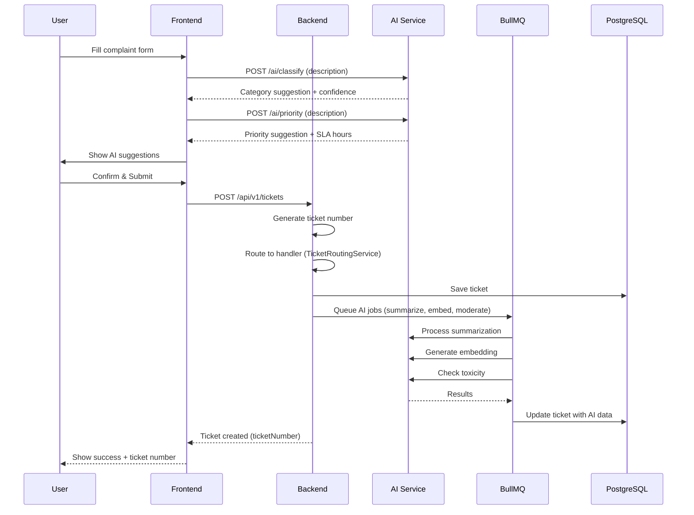
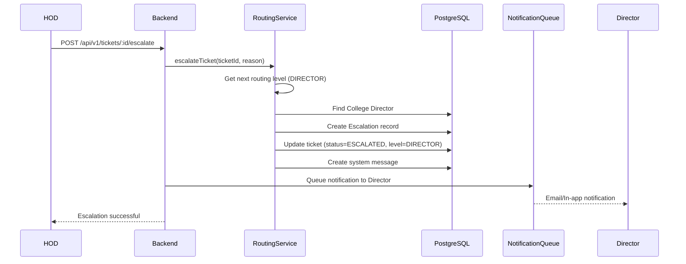
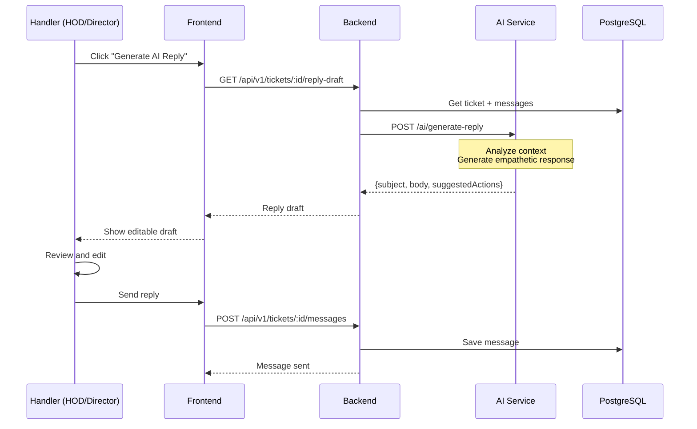
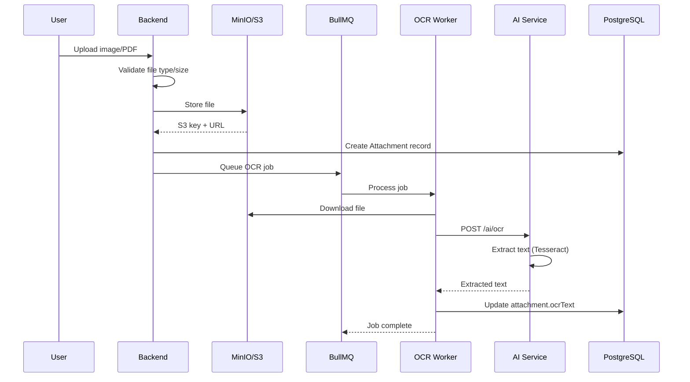
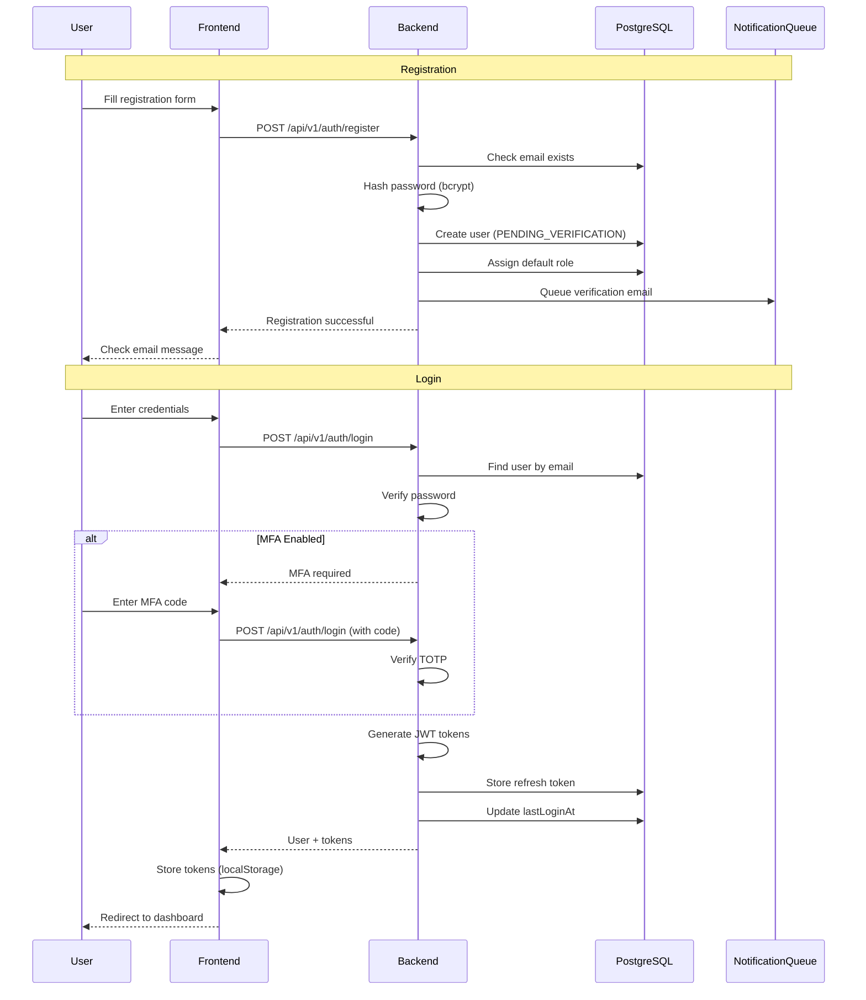
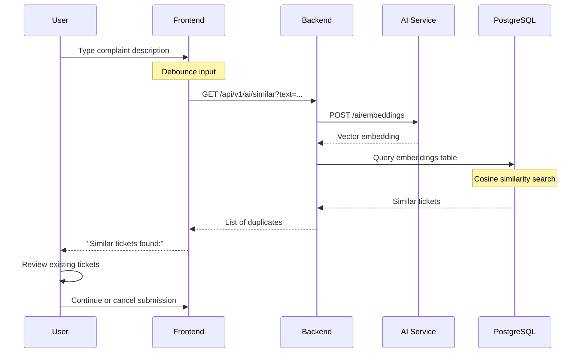
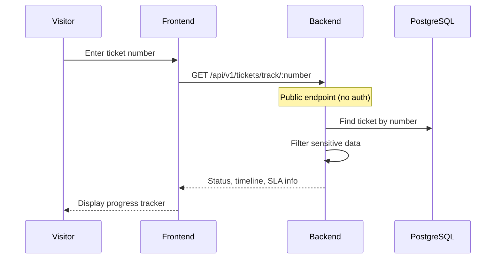
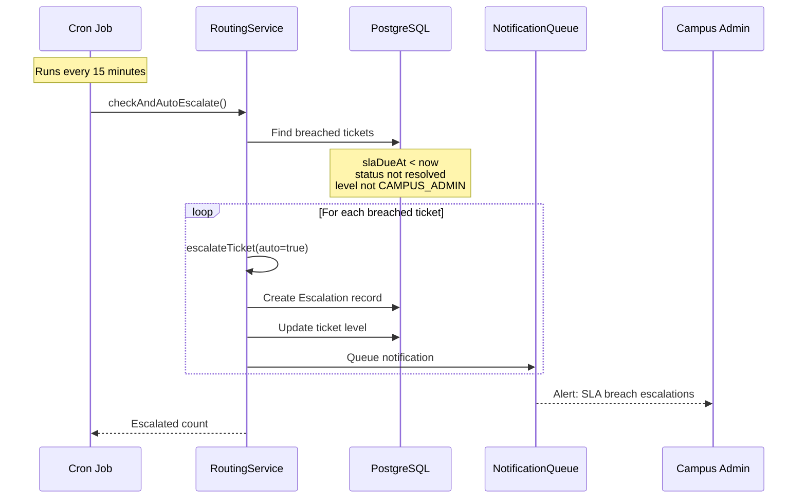

# Sequence Diagrams

## 1. Ticket Creation with AI Classification

## 2. Escalation Flow

## 3. AI Reply Draft Generation

## 4. OCR Processing Flow

## 5. User Registration & Login

## 6. Duplicate Detection Flow

## 7. Public Ticket Tracking

## 8. Auto-Escalation (SLA Breach)

